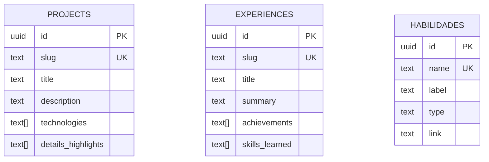
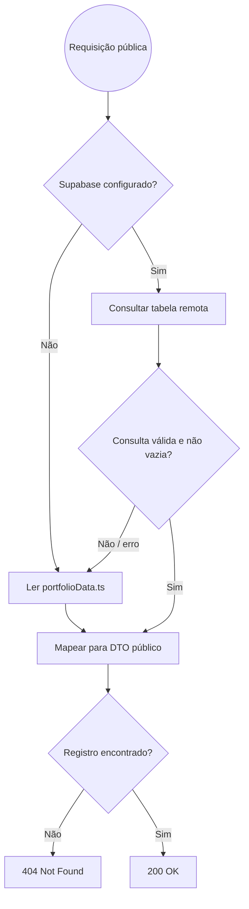

# RFC — Arquitetura Local-First com Persistência Remota Opcional

|            |              |
| ---------- | ------------ |
| **Status** | **Aprovada** |
| **Time**   | DevFolio     |
| **Data**   | 25/09/2026   |
| **Versão** | 1.0          |

## Contextualização

### Entendendo o problema

Um portfólio deve continuar acessível depois de um clone, durante o desenvolvimento offline e quando o provedor remoto estiver indisponível. Tornar o Supabase obrigatório cria dependência operacional para uma experiência que é essencialmente de leitura e aumenta o custo de adoção do template.

Ao mesmo tempo, usuários avançados precisam de conteúdo editável em nuvem. A arquitetura deve oferecer os dois caminhos sem duplicar componentes públicos nem deixar uma falha de configuração remota interromper a navegação.

### Explicando a solução de forma macro

`src/data/portfolioData.ts` e `public/images/` são a fonte local de fallback. `src/lib/portfolio.ts` expõe uma interface única para projetos, experiências e habilidades: consulta o Supabase apenas quando as credenciais são válidas, mapeia o modelo remoto para o modelo de apresentação e retorna os dados locais quando não há configuração, a consulta falha ou a tabela está vazia.

A camada pública não conhece a origem dos dados. Isso preserva as rotas Next.js e permite habilitar a nuvem por variáveis de ambiente, sem migração obrigatória para quem usa o template localmente.

### Alternativas Descartadas e Trade-offs

- _Supabase obrigatório_ — descartado porque impede execução imediata e offline. Ganharia apenas em ambientes exclusivamente administrados por CMS.
- _Somente dados estáticos_ — descartado porque exige commit e deploy para cada alteração. Ganharia apenas em portfólios imutáveis ou com pipeline editorial externo.
- _Duplicar lógica em cada página_ — descartado porque espalha fallback, mapeamento e tratamento de erro. Ganharia apenas em um protótipo muito pequeno e temporário.

## Implementação

### Diretriz Obrigatória de Testes

> **Padrão do DevFolio:** validar a experiência pública com testes E2E do Cypress e validar o contrato remoto com testes de integração quando o Supabase estiver habilitado. Não introduzir mocks como substituto da execução local real.

### Rotas Propostas

| Método | Caminho               | O que faz            | Entrada (campos que importam) | Saídas (status e quando)               |
| ------ | --------------------- | -------------------- | ----------------------------- | -------------------------------------- |
| `GET`  | `/`                   | Exibe o portfólio    | Nenhuma                       | `200` com dados locais ou remotos      |
| `GET`  | `/projetos`           | Lista projetos       | Nenhuma                       | `200` com fallback transparente        |
| `GET`  | `/projetos/{slug}`    | Consulta projeto     | `slug` no caminho             | `200` encontrado; `404` quando ausente |
| `GET`  | `/experiencias`       | Lista experiências   | Nenhuma                       | `200` com fallback transparente        |
| `GET`  | `/experiencia/{slug}` | Consulta experiência | `slug` no caminho             | `200` encontrado; `404` quando ausente |

### Banco de Dados (Diagrama ER)

### Desenho de Fluxo da Rota

### Fluxos Detalhados Textuais

#### Fluxo 1: Caminho Feliz

1. A rota chama a função da camada `portfolio`.
2. A camada verifica as variáveis do Supabase e consulta a tabela correspondente quando aplicável.
3. Os campos snake_case remotos são convertidos para o DTO camelCase usado pelos componentes.
4. A página renderiza o resultado com `200`.

#### Fluxo 2: Caminhos de Falha

1. Sem credenciais válidas, a camada usa os dados locais.
2. Em erro remoto ou resposta vazia, a camada registra o erro e usa os dados locais.
3. Se o slug não existir nem no remoto nem no fallback, a página responde `404`.

## Principal Desafio

- **Qual é:** manter uma única experiência pública coerente com duas origens de dados.
- **Por que é difícil:** indisponibilidade, schema divergente e resultados vazios não podem virar erro de renderização nem alterar o contrato dos componentes.
- **Como o desenho resolve:** a camada `src/lib/portfolio.ts` centraliza seleção de origem, mapeamento e fallback; as páginas dependem apenas dos tipos `PortfolioProject`, `PortfolioExperience` e `PortfolioTechnology`.
