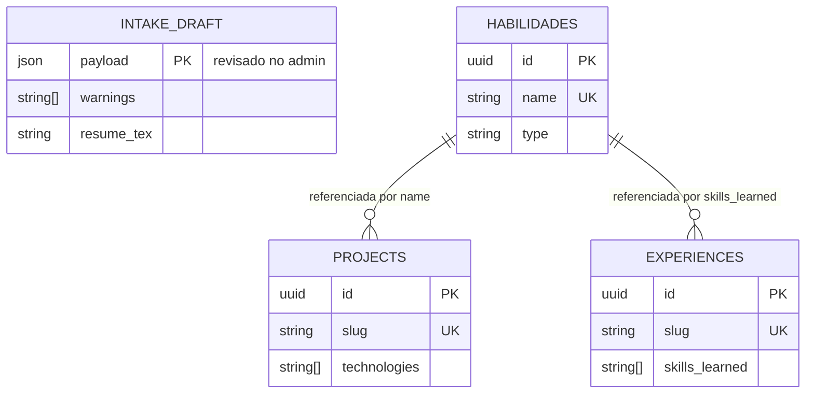
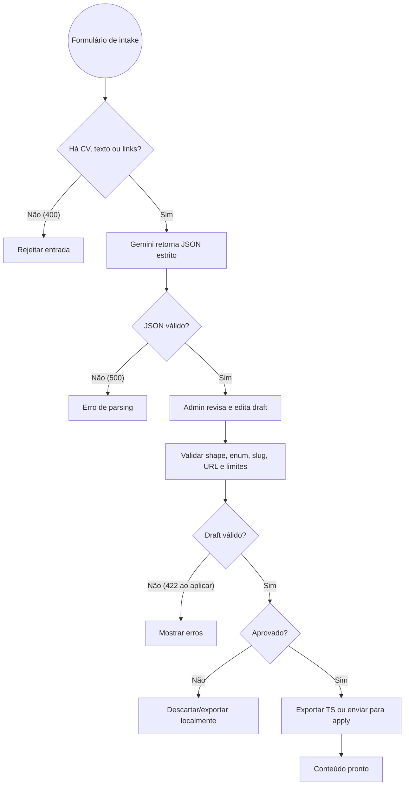

# RFC — Pipeline de Intake de Currículo com IA e Aprovação Humana

|            |              |
| ---------- | ------------ |
| **Status** | **Aprovada** |
| **Time**   | DevFolio     |
| **Data**   | 25/09/2026   |
| **Versão** | 1.0          |

## Contextualização

### Entendendo o problema

Transformar currículo, links de repositórios e projetos em conteúdo estruturado de portfólio manualmente é repetitivo e favorece inconsistências de nomes, slugs, URLs e listas de tecnologias. Uma resposta de IA também pode conter JSON inválido, alegações não verificáveis ou campos fora do contrato.

O risco principal é persistir conteúdo gerado sem revisão, contaminando o portfólio público. O fluxo precisa tratar a IA como extratora assistida, nunca como autoridade final.

### Explicando a solução de forma macro

O admin envia PDF/texto de currículo, links e observações para `POST /api/intake/parse`. A rota chama o Gemini, exigindo JSON estrito no formato `IntakeDraft`. O resultado segue para `POST /api/intake/validate`, que verifica coleções, enum de habilidades, slugs, URLs e limites de conteúdo.

A tela `/admin/intake` apresenta o draft para edição e aprovação. O usuário pode exportar `portfolioData.ts` no modo Local-First ou enviar o draft aprovado à rota de aplicação no modo Supabase. A geração opcional de currículo LaTeX permanece parte do draft, sem alterar o caminho de aprovação.

### Alternativas Descartadas e Trade-offs

- _IA escrevendo diretamente no banco_ — descartada porque elimina revisão e torna uma saída incorreta imediatamente pública. Ganharia apenas em um pipeline interno com revisão posterior e rollback garantido.
- _Parser determinístico exclusivo_ — descartado porque não interpreta bem descrições livres e resultados de projetos. Ganharia em currículos com schema rígido e vocabulário controlado.
- _Aceitar JSON sem validação_ — descartado porque falhas de tipo e URLs quebrariam o admin ou a persistência. Ganharia apenas em uma prova de conceito descartável.

## Implementação

### Diretriz Obrigatória de Testes

> O fluxo deve ser testado por integração via endpoints Next.js e pela jornada E2E do Cypress: envio, revisão, validação e exportação/aplicação. A validação não deve depender de mocks de banco para comprovar o contrato.

### Rotas Propostas

| Método | Caminho                | O que faz                       | Entrada (campos que importam)                                                        | Saídas (status e quando)                                                                                    |
| ------ | ---------------------- | ------------------------------- | ------------------------------------------------------------------------------------ | ----------------------------------------------------------------------------------------------------------- |
| `POST` | `/api/intake/parse`    | Produz draft com IA             | `cv_file` ou `cv_text`, `github_links`, `project_links`, `notes`, opções de conteúdo | `200` draft; `400` entrada/chave ausente; `500` falha do provedor                                           |
| `POST` | `/api/intake/validate` | Valida draft antes de persistir | `{ draft }`                                                                          | `200` com `valid`, `errors`, `warnings`; `400` draft ausente                                                |
| `POST` | `/api/intake/apply`    | Faz upsert do draft aprovado    | `{ draft }`, Bearer token                                                            | `200` aplicado; `207` aplicação parcial; `401` token inválido; `422` draft inválido; `503` Supabase ausente |

### Banco de Dados (Diagrama ER)

### Desenho de Fluxo da Rota

### Fluxos Detalhados Textuais

#### Fluxo 1: Caminho Feliz

1. O admin envia ao menos uma fonte de conteúdo.
2. O Gemini retorna o `IntakeDraft` sem markdown.
3. O admin revisa o resultado e solicita validação.
4. A validação retorna `valid: true`; o admin exporta localmente ou aplica no Supabase.

#### Fluxo 2: Caminhos de Falha

1. Sem fonte de entrada ou chave Gemini: `400`.
2. Resposta que não é JSON: `500`.
3. Draft com shape, enum, slug ou URL inválidos: erros de validação; a aplicação responde `422`.
4. Falha em apenas uma entidade durante upsert: relatório com `207` e erros por coleção.

## Principal Desafio

- **Qual é:** converter texto não estruturado em dados utilizáveis sem permitir que a IA publique afirmações incorretas.
- **Por que é difícil:** o provedor pode omitir campos, produzir tipos errados ou interpretar links de modo incompleto; além disso, o conteúdo precisa preservar acentos e chaves canônicas.
- **Como o desenho resolve:** JSON estrito, validação independente, revisão humana e dois destinos explícitos: exportação local ou aplicação autenticada.
