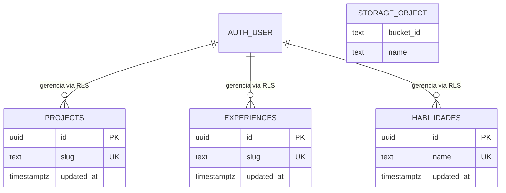
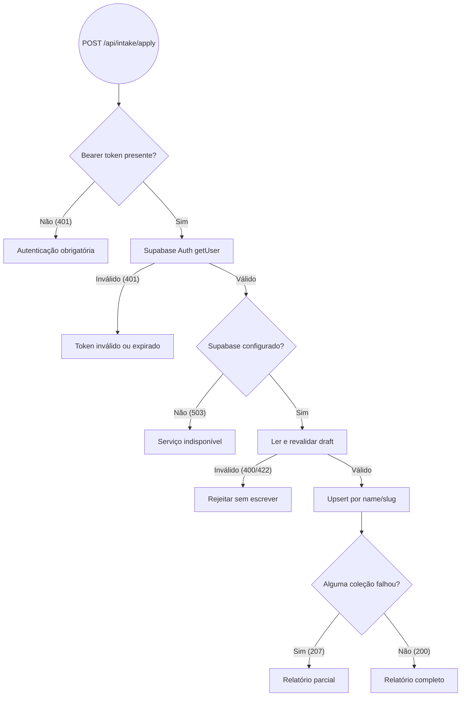

# RFC — Administração Remota com Supabase Auth, RLS e Upsert Idempotente

|            |              |
| ---------- | ------------ |
| **Status** | **Aprovada** |
| **Time**   | DevFolio     |
| **Data**   | 25/09/2026   |
| **Versão** | 1.0          |

## Contextualização

### Entendendo o problema

O painel administrativo precisa permitir a manutenção de projetos, experiências, habilidades e imagens sem expor operações de escrita ao visitante público. Como o DevFolio é um template reutilizável, a solução também deve falhar de modo explícito quando o Supabase não estiver configurado, preservando o modo Local-First.

A ausência de uma fronteira de autorização permitiria que qualquer cliente alterasse o conteúdo do portfólio. Também seria fácil criar duplicatas ao reaplicar o mesmo intake ou deixar o banco em estado parcialmente atualizado quando apenas uma coleção falhar.

### Explicando a solução de forma macro

O Supabase Auth autentica o usuário e as policies de Row Level Security liberam leitura pública, mas restringem `insert`, `update` e `delete` a sessões autenticadas. A rota `POST /api/intake/apply` recebe o Bearer token, confirma o usuário com `auth.getUser()`, revalida o draft e executa upserts por chaves estáveis: `name` para habilidades e `slug` para projetos e experiências.

O schema cria triggers de `updated_at` e um bucket público para mídias, com escrita de objetos restrita a usuários autenticados. A aplicação reporta contagens por coleção e usa `207 Multi-Status` quando uma coleção falha, evitando declarar sucesso total indevidamente.

### Alternativas Descartadas e Trade-offs

- _Chave de serviço no navegador_ — descartada porque permitiria contornar RLS e exporia privilégio administrativo. Ganharia apenas em um job server-side isolado sem acesso do cliente.
- _Autorização somente na interface_ — descartada porque requisições podem ser forjadas fora da UI. Ganharia apenas como conveniência visual, nunca como controle de segurança.
- _Inserções sem chave de conflito_ — descartadas porque reaplicações gerariam duplicatas. Ganhariam apenas para dados estritamente imutáveis com IDs gerados previamente.

## Implementação

### Diretriz Obrigatória de Testes

> Testar a rota de aplicação com sessão válida, token ausente, token inválido, Supabase ausente, draft inválido e falha parcial de coleção. Testar também as policies no banco real e o acesso público de leitura. Não considerar o estado da tela admin como prova de autorização.

### Rotas Propostas

| Método | Caminho             | O que faz                | Entrada (campos que importam)                | Saídas (status e quando)                                                                                         |
| ------ | ------------------- | ------------------------ | -------------------------------------------- | ---------------------------------------------------------------------------------------------------------------- |
| `POST` | `/api/intake/apply` | Aplica conteúdo revisado | `Authorization: Bearer <token>`, `{ draft }` | `200` tudo aplicado; `207` parcial; `401` ausente/inválido; `422` draft inválido; `503` Supabase não configurado |
| `GET`  | `/projetos`         | Leitura pública          | Nenhuma                                      | `200` com RLS permitindo select                                                                                  |
| `GET`  | `/experiencias`     | Leitura pública          | Nenhuma                                      | `200` com RLS permitindo select                                                                                  |

### Banco de Dados (Diagrama ER)

### Desenho de Fluxo da Rota

### Fluxos Detalhados Textuais

#### Fluxo 1: Caminho Feliz

1. A requisição apresenta um Bearer token.
2. O Supabase confirma a sessão e o draft passa pela mesma validação do endpoint de validação.
3. Habilidades, experiências e projetos são aplicados com suas chaves naturais.
4. A resposta retorna as contagens aplicadas com `200`.

#### Fluxo 2: Caminhos de Falha

1. Token ausente ou inválido: `401`.
2. Supabase ausente no servidor: `503`.
3. JSON ausente ou inválido: `400`; draft semanticamente inválido: `422`.
4. Erro em uma coleção: demais coleções podem ser reportadas e o status é `207`.

## Principal Desafio

- **Qual é:** combinar segurança de escrita, reaplicação idempotente e diagnóstico de falhas parciais.
- **Por que é difícil:** autenticação de rota e RLS são camadas diferentes; além disso, três upserts independentes não formam uma transação única através da API REST.
- **Como o desenho resolve:** o token é validado no servidor, o banco aplica RLS independentemente da UI, as chaves únicas tornam reaplicações determinísticas e o relatório explicita qualquer estado parcial para correção operacional.
